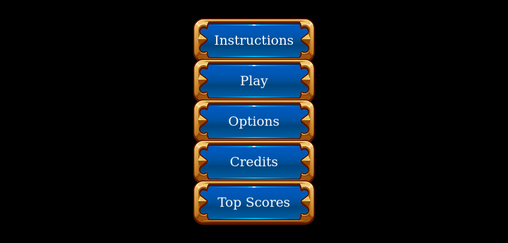
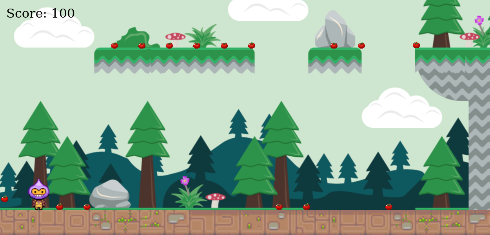
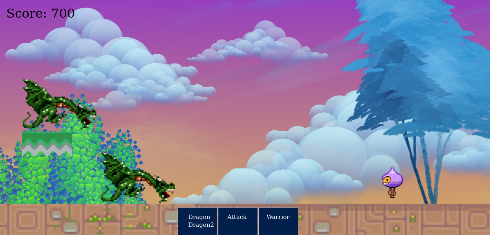
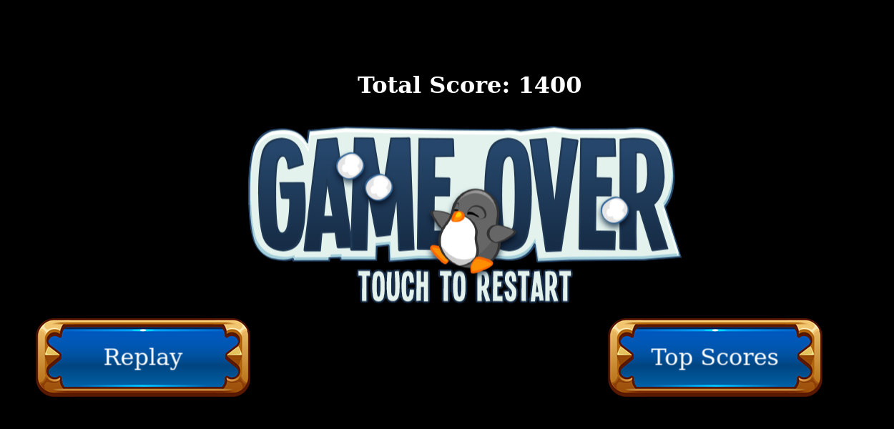
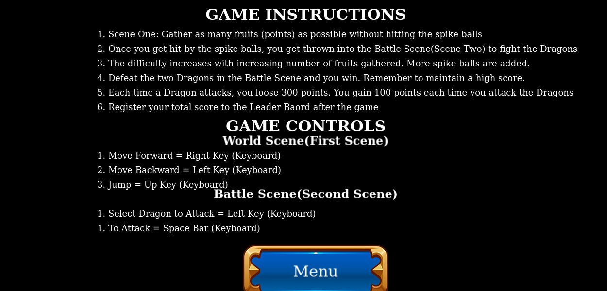

# Legend_of_the_Seeker
A warrior must seek and retrieve a lost treasure belonging to his village. In his quest, he must avoid being hit by spikeballs and must also gather as much fruits (points) as possible to sustain his adventure. In the end, he must fight off the greatest villians of all, two fire-spitting dragons.

### Screenshots






## Built With
- Javascript.
- HTML.
- Bootstrap.
- Phaser3.

## Tools
- Jest.
- Webpack.
- Leader Board API.
- Postman.
- Opengamearts.

## Live Game
[Live](https://george-shammar.github.io/Legend_of_the_Seeker/)!!

Visit the link above to play the game online or see the "Getting Started" section below to get a copy on your local computer.

## Getting Started

To play the game on your computer, please follow these instructions.

- Go to the "Code" section of this repository and press the green button that says "Code". Copy the URL or the SSH key.
- Go to your terminal and enter:
```
git clone URL/SSH key
```

The URL or SSH are the links copied from the first step above.

- If you don't have git installed, you can download this project and unzip it in your desired folder.
- Change directory into the folder the application is saved by using the command below from the Command Line Interface or terminal.
```
cd directory
```
Directory is the name of your folder.

- Once you have the local copy in your desired folder, go back to your terminal and run:
```
npm install
```
This command installs all the game dependencies. Once you complete all installations successfully, you're ready to play.

- To start playing, run:
```
npm start
```
- The game will open up in your browser.

## Game Overview

- There are two game scenes apart from the other scenes that enhances usability like Options Scene, Credit Scenes e.t.c
- The two scenes are the World Scene (Or Game Scene) and the Battle Scene.
- The player moves from the World Scene to the Battle Scene and then the game is over either with a victory or a defeat.
- The game can be replayed as many times as possible.
- Use the Options menu to customize your game experience. E.g By enabling and disabling the sounds.
- You can also view how you rank on the Leader Board.

## Game Objectives

### World Scene
- Your primary objective is to win with as much points as possible so as to feature on the Leader Board.
- At the World Scene (The first scene), you are expected to gather as much fruits (points) as possible. Each fruit gathered is 100 points.
- While gathering the fruits (points), you must not get touched by the bouncing spike balls, else you enter the Battle Scene to fight the Dragons immediately.
- At the World Scene, the difficulty level increases with the number of fruits you have gathered. The number of spike balls you have to avoid is incremented with increasing points you have gathered.
- Eventually, you'll get touched by the spike balls and then you'll move to the Battle Scene - TO FIGHT.

### Battle Scene
- In this scene, you have to defeat two dragons while making sure you don't loose much points.
- Each time you get hit by a dragon, you loose 300 points.
- Each time you hit a dragon, you gain 100 points. There is a point deficit of 200 points. So, the longer you remain in the Battle Scene, the more likely it is for you to exhaust all the points you have gathered from the World Scene.
- Once your points reach 0, you have lost the Battle and the game is over.
- Your final score at that point gets registered with your name on the Leader Baord.

### Leader Board
- You feature on the Leader Board if your total score is in the first 10 highest scores.
- The scoring system is such that the total score from the first scene(World Scene) is bookmarked and used later on the Leader Board. Otherwise, if the battle is lost, the player's score would be zero with nothing to record on the Leaderboard.

## Game Controls

### World Scene
- Jump: Up Keyboard Key.
- Forward: Right Keybaord Key.
- Backward: Left Keyboard Key.

### Battle Scene
- Select Dragon to Attack: Left Keyboard Key.
- To change selection up or down: Up and Down Keyboard Key.
- To confirm selected dragon to attack and initiate attack: Space bar.

## Tests
- All non phaser3 classes and functions were tested using Jest.
- To see the tests, run the code below in your Command Line Interface:
```
npm run test
```
## Developer

👤 **George Gbenle**

- GitHub: [george-shammar](https://github.com/george-shammar)
- Twitter: [@GeorgeShammar](https://twitter.com/GeorgeShammar)
- LinkedIn: [George Gbenle](https://www.linkedin.com/in/georgegbenle/)


## 🤝 Contributing

Contributions, issues and feature requests are welcome!


## Show your support

Give a ⭐️ if you like this project!


## 📝 License

This project is [MIT](LICENSE) licensed.

## Acknowledgments
- Phaser3
